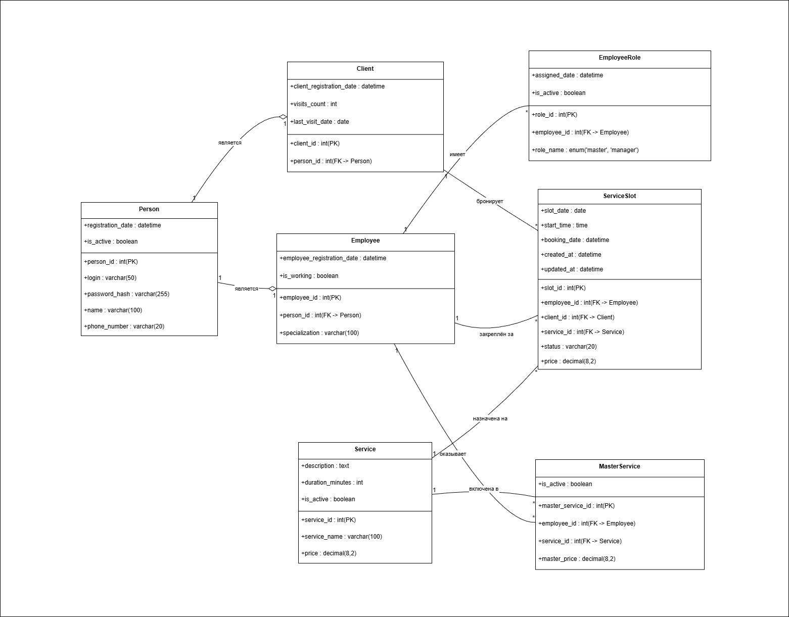

# BSA9_Objects-and-Roles

Проект по описанию классов и сущностей, построению диаграммы классов UML для системы онлайн-записи барбершопа (BRB).

## 🛠 Навыки
- Class Diagram (UML)
- Entity Description
- Attribute Definition (type, length, mandatory, default)
- Primary / Foreign Keys
- Relationships (1:1, 1:*, *:*)

## 📋 Описание проекта
В ходе работы я разработала структуру классов и сущностей для системы онлайн-записи барбершопа на основе вариантов использования и требований задачи.

### Что именно было сделано:
1. **Класс «Персоны» (ex00)**: Описала базовый класс для хранения регистрационных и контактных данных всех участников системы (клиентов и сотрудников). Атрибуты: person_id (PK), login, password_hash, name, phone_number, registration_date, is_active.
2. **Сущности «Клиенты» и «Сотрудники» (ex01)**: Описала наследуемые сущности. Клиенты: client_id (PK), person_id (FK → Персоны), client_registration_date, visits_count, last_visit_date. Сотрудники: employee_id (PK), person_id (FK → Персоны), employee_registration_date, specialization, is_working.
3. **Сущности-справочники (ex02)**: Описала «Роли сотрудника» (role_id, employee_id, role_name, assigned_date, is_active), «Услуги» (service_id, service_name, description, duration_minutes, price, is_active), «Услуги мастера» (master_service_id, employee_id, service_id, master_price, is_active).
4. **Сущность «Слоты обслуживания» (ex03)**: Описала основную операционную сущность для бронирования. Атрибуты: slot_id (PK), slot_date, start_time, employee_id (FK → Сотрудники), client_id (FK → Клиенты), service_id (FK → Услуги), status, booking_date, price, notes, created_at, updated_at.
5. **Диаграмма классов UML (ex04)**: Построила диаграмму классов в нотации UML с указанием классов, атрибутов, первичных и внешних ключей, связей между классами (1:1, 1:*).
6. **Сущности «Скидки клиенту» и «Извещение клиента» (ex05)**: Описала дополнительные сущности. «Скидки клиенту»: discount_id, discount_type, discount_value, client_id, service_id, valid_from, valid_until, usage_limit, used_count, is_active, description. «Извещение клиента»: notification_id, client_id, slot_id, notification_type, channel, message_text, scheduled_send_time, actual_send_time, status, error_message, created_at.
7. **Актуализация диаграммы классов (ex06)**: Добавила сущности «Скидки клиенту» и «Извещение клиента» в диаграмму классов, обновив связи.

## 🔍 Пример диаграммы классов UML

Ниже показана диаграмма классов для системы онлайн-записи барбершопа (основные сущности и их связи).

## 📂 Файлы
Все рабочие материалы проекта находятся в репозитории выше:
- [BRB/](./BRB/) — аналитика по проекту барбершопа (онлайн-запись) – включает описания классов и сущностей, диаграммы классов UML.
